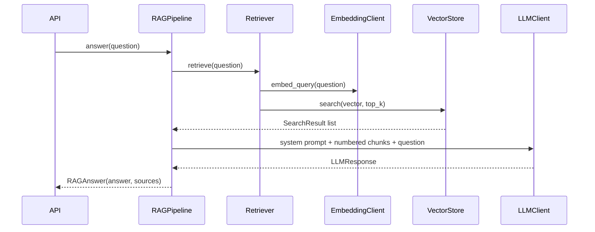

# Architecture

## 1. Overall architecture

The code is organized in layers. Each layer only uses the layers below it.

```
API            app/main.py, app/api/, app/schemas/
Multi-Agent    app/agents/supervisor.py
Agent          app/agents/ (tools, tool_agent, specialized agents)
RAG            app/rag/ (chunker, ingestion, retriever, pipeline)
Boundaries     app/llm/, app/embeddings/, app/documents/, app/vectorstore/
Foundation     app/core/ (config, logging), app/db/ (models, sessions)
```

The API layer is thin: validate the request, call one application object, map the result to a response.
All object construction happens in `app/api/dependencies.py`, which reads the configuration and passes
dependencies through constructors. There is no DI framework; FastAPI `Depends()` is only used at the HTTP
boundary, which also lets tests swap real providers for fakes with `app.dependency_overrides`.

## 2. Dependency direction

Business logic depends on abstract classes, and concrete implementations depend on the same abstract
classes. Nothing in `app/rag/` or `app/agents/` imports an SDK or SQLAlchemy.

```
RAGPipeline ──► Retriever ──► EmbeddingClient ◄── OpenAIEmbeddingClient / GeminiEmbeddingClient
                    │
                    └───────► VectorStore     ◄── PostgresVectorStore / InMemoryVectorStore
RAGPipeline ──► LLMClient                     ◄── OpenAIClient / GeminiClient
Supervisor  ──► dict[str, Agent]              ◄── RAGAgent / GeneralAgent / SummarizerAgent
ToolCallingAgent ──► Tool                     ◄── RAGSearchTool / CalculatorTool
```

The factories (`app/llm/factory.py`, `app/embeddings/factory.py`) are the only code that maps a provider
name from configuration to a concrete class.

### When an abstraction was (and was not) created

An abstract class exists only where there are several real implementations or an infrastructure boundary
that tests must replace:

| Abstraction | Why it exists |
| --- | --- |
| `LLMClient` | Two providers (OpenAI, Gemini); tests need a scripted fake |
| `EmbeddingClient` | Two providers; tests need deterministic offline vectors |
| `DocumentLoader` | Three file formats with different parsing |
| `VectorStore` | Database boundary; unit tests use the in-memory version |
| `Tool` | The agent loop must run any tool without knowing which one |
| `Agent` | The supervisor routes between agents that work differently (tool loop vs. single call) |

Deliberately **not** abstracted:

- **Retriever** – there is one retrieval strategy, and it is already testable because it is built from
  two abstractions (`EmbeddingClient`, `VectorStore`). Tests use the real `Retriever` with fakes.
- **Chunker** – one strategy, so it is a plain function `chunk_text()`.
- **Database access** – no repository layer; `PostgresVectorStore` uses SQLAlchemy directly.

## 3. LLM abstraction

`app/llm/base.py` defines `LLMClient.generate(messages, tools) -> LLMResponse` and small frozen
dataclasses: `Message`, `ToolCall`, `ToolSpec`, `Usage`, `LLMResponse`.

Each provider converts in both directions:

```
list[Message] + list[ToolSpec] ──► provider request format ──► SDK call
SDK response ──► LLMResponse(content, model, usage, tool_calls)
```

Differences the providers hide:

- OpenAI sends system prompts as messages; Gemini takes them as `system_instruction`.
- OpenAI tool arguments are a JSON string; Gemini gives a dict.
- Gemini can attach a `thought_signature` to a tool call that must be sent back unchanged. It is kept in
  `ToolCall.signature`, an opaque value the rest of the code ignores.
- Gemini's automatic function calling is disabled because the agent loop executes tools itself.

## 4. Embedding abstraction

`EmbeddingClient.embed(texts) -> list[list[float]]` plus `embed_query(text)`. The constructor takes the
vector `dimension`, which both providers pass to their API (`dimensions` for OpenAI,
`output_dimensionality` for Gemini) so the vectors fit the `vector(768)` database column. Each provider
splits large inputs into batches that respect its API limit.

## 5. Document loader abstraction

`DocumentLoader.load(data: bytes) -> str`. Loaders take bytes, not paths, because files arrive as HTTP
uploads. `get_loader(filename)` in `app/documents/loaders.py` picks a loader by extension:

| Extension | Loader | Behaviour |
| --- | --- | --- |
| `.txt` | `TextLoader` | UTF-8 decode |
| `.md` | `MarkdownLoader` | UTF-8 decode, remove YAML front matter |
| `.pdf` | `PDFLoader` | pypdf text extraction per page |

Unreadable files raise `ValueError`, which the API turns into `400 Bad Request`.

## 6. Vector store abstraction

`VectorStore` has three operations: `find_document(file_hash)`, `add_document(...)` and
`search(embedding, top_k)`. Search results are `SearchResult` dataclasses with the filename, chunk index,
content and a cosine similarity score, so callers never see database rows.

- `PostgresVectorStore` stores rows in the `documents` and `chunks` tables and orders by pgvector's
  `cosine_distance` (score = 1 − distance).
- `InMemoryVectorStore` keeps a list and computes cosine similarity in Python.

Schema (managed by Alembic, `alembic/versions/0001_...`):

```
documents(id, filename, file_hash UNIQUE, created_at)
chunks(id, document_id → documents.id ON DELETE CASCADE, chunk_index, content, embedding vector(768))
```

## 7. RAG flow



Ingestion is the mirror image, in `DocumentIngestor`: hash → skip if known → load → chunk → embed → store.

## 8. Agent flow

`ToolCallingAgent` compiles a LangGraph `StateGraph` over a dataclass state:

```python
@dataclass
class AgentState:
    messages: list[Message]
    steps: int = 0
```

```
START → llm → (last message has tool calls and steps < max_steps) ? tools → llm : END
```

- `llm` node: calls `LLMClient.generate` with the conversation and the tool specs, appends the reply,
  increments `steps`.
- `tools` node: runs each requested tool and appends one `tool` message per call. Unknown tools and
  `ValueError`s become error text for the LLM instead of exceptions.
- `max_steps` (from `config.yaml`) caps the number of LLM calls; LangGraph's `recursion_limit` is set to
  match as a second guard.

Concrete agents only set `name`, `description`, `system_prompt` and their tool list:
`AssistantAgent` (both tools, used by `mode=agent`), `RAGAgent`, `GeneralAgent`. `SummarizerAgent`
implements `Agent` directly with a single LLM call because it needs no tools.

## 9. Multi-agent flow

`Supervisor` is a second, simpler LangGraph graph:

```
START → route → <chosen agent> → END
```

`route` sends the agent names and descriptions to the LLM and asks for one name. The answer is
normalized (case, quotes, trailing period); an unknown name falls back to the default agent (`general`).
Each agent is a node; the conditional edge after `route` picks the node by name. The result reports
which agent answered.

## 10. Testing strategy

| Level | What | How |
| --- | --- | --- |
| Unit | Each component in isolation | `tests/unit/`, fakes from `tests/fakes.py`, `InMemoryVectorStore` |
| Provider conversion | OpenAI / Gemini request and response mapping | SDK objects built locally, SDK call replaced with a stub |
| API | Routes, validation, status codes | FastAPI `TestClient` with `dependency_overrides` |
| Database | Real pgvector search | `tests/integration/test_postgres_vectorstore.py`, runs only with `TEST_DATABASE_URL` |

Fakes live in `tests/`, not in `app/`, so production code never ships a fake provider. No test needs
internet access or an API key.
